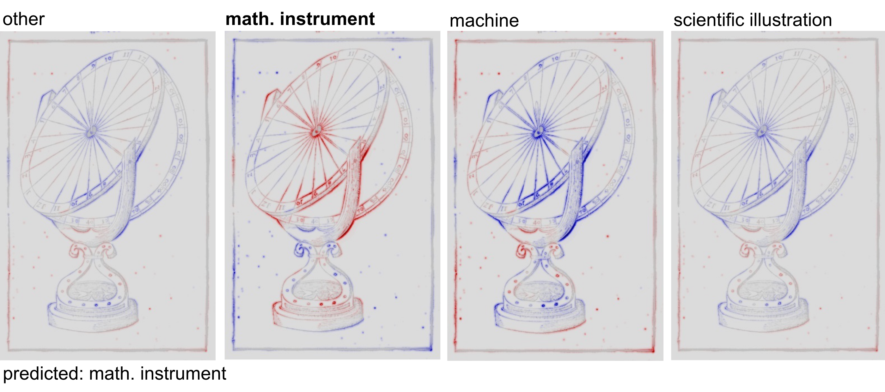

<!-- Improved compatibility of back to top link: See: https://github.com/othneildrew/Best-README-Template/pull/73 -->
<a name="readme-top"></a>
<!--
*** Thanks for checking out the Best-README-Template. If you have a suggestion
*** that would make this better, please fork the repo and create a pull request
*** or simply open an issue with the tag "enhancement".
*** Don't forget to give the project a star!
*** Thanks again! Now go create something AMAZING! :D
-->


<!-- PROJECT LOGO -->
<br />
<div align="center">
  <!-- <a href="https://github.com/othneildrew/Best-README-Template">
    
  </a>
  <a href="https://github.com/othneildrew/Best-README-Template">
    
  </a>
  <a href="https://github.com/othneildrew/Best-README-Template">
    
  </a> -->


  <h3 align="center">Explainability and Transparency in the Realm of Digital Humanities: Toward a Historian XAI</h3>

  <!-- <p align="center">
    An awesome README template to jumpstart your projects!
    <br />
    <a href="https://github.com/othneildrew/Best-README-Template"><strong>Explore the docs »</strong></a>
    <br />
    <br />
    <a href="https://github.com/othneildrew/Best-README-Template">View Demo</a>
  </p> -->
</div>


<!-- ABOUT THE PROJECT -->
## About The Project

This project is a cooperation between the [Sphere Project](https://sphaera.mpiwg-berlin.mpg.de/) at the [Max Planck Institute for the History of Science](https://www.mpiwg-berlin.mpg.de/) and the [Machine Learning Group at TU Berlin](https://web.ml.tu-berlin.de/) within the frame of the [BIFOLD](https://www.bifold.berlin/). The driving force behind this project is our shared belief that AI applications in the humanities should be transparent and explainable. On the one hand, this allows the validation of humanities hypotheses that would otherwise be direclty tied to a model's output; on the other, such approaches open the door towards a more "engaging" and "interrogative" interaction with an AI model in the humanities. 

### Case Studies 
To implement such an approach, we relied heavily on the [S-VED dataset](https://doi.org/10.5281/zenodo.7142456), and enriched it with some extra classes to achieve our objective. We proposed three different case studies  - based on this extended dataset - with the aim on generating a 'new' definition of three types of illustration in Early Modern Editions of the [Sphaera Corpus](http://db.sphaera.mpiwg-berlin.mpg.de/), namely, 'Mathematical Instruments', 'Machines', and 'Scientific Illustrations'. These 'new' definitions, derived with XAI methods, help us better hypothesize what were the relevant visual features of each of these classes in the eyes of the early modern printer. The image below shows an example of an LRP heatmap of a mathematical instrument from our method. Regions in red, such as the graduated elements and the base, contribute positively to the classification of a 'mathematical instrument' and play an major role in the definition of what is a mathematical instrument in our dataset. 



### Approach generalization
While our method is based on the well curated [Sphaera Corpus](http://db.sphaera.mpiwg-berlin.mpg.de/), this approach is easily transferable to other [historical] datasets. To implement this on your own dataset see the [Getting Started](#getting-started) section below


### Paper Abstract
The recent advancements in the field of Artificial Intelligence (AI) translated to an increased adoption of AI technology in the humanities, which is often challenged by the limited amount of annotated data, as well as its heterogeneity. Despite the scarcity of data it has become common practice to design increasingly complex AI models, usually at the expense of human readability, explainability, and trust. This in turn has led to an increased need for tools to help humanities scholars better explain and validate their models as well as their hypotheses. In this paper, we discuss the importance of employing Explainable AI (XAI) methods within the humanities to gain insights into historical processes as well as ensure model reproducibility and a trustworthy scientific result. To drive our point, we present several representative case studies from the _Sphaera_ project where we analyze a large, well-curated corpus of early modern textbooks using an AI model, and rely on the XAI explanatory outputs to generate historical insights concerning their visual content. More specifically, we show that XAI can be used as a partner when investigating debated subjects in the history of science, such as what strategies were used in the early modern period to showcase mathematical instruments and machines.


### Cite
```
@article{ElHajjEberle2023,
author = {Hassan El-Hajj and Oliver Eberle and Anika Merklein and Anna Siebold and Noha Shlomi and Jochen Buettner and Julius Matrinetz and Klaus-Robert Mueller and Grégoire Montavon and Matteo Valleriani},
title = {Explainability and Transparency in the Realm of Digital Humanities: Towards a Historian XAI},
year = {2023},
journal = {Internation Journal of Digital Humanities},
publisher = {Springer}
}
```


<p align="right">(<a href="#readme-top">back to top</a>)</p>


<!-- GETTING STARTED -->
## Getting Started

This is an example of how you may give instructions on setting up your project locally.
To get a local copy up and running follow these simple example steps.

### Prerequisites and Installation

To get starte clone this repositry:
 ```sh
git clone https://github.com/oeberle/xai_digital_humanities.git
  ```

To make sure you have all required packages installed we provide a `requirements.txt`
 that you can install using:
 ```sh
pip3 install -r requirements.txt
  ```
After activating this environment you should be ready to use the code.


<!-- USAGE EXAMPLES -->
## A)   XAI for historical instruments

**Get started:** To reproduce the results found in our paper, you can execute the  `xai_analysis.ipynb`
notebook. Our trained model weights `model.pt` can be downloaded by exceuting `git lfs pull` in the project repository.

**Data:** We have provided sample data in the `sample_data/pages` directory. The accompanying csv-file `sample_data/data_subset.csv` contains further information about the source and label of each sample. 

**XAI**: Our explanation code for the computation and visualization of LRP heatmaps can be found in `xai.py`.  An in-depth tutorial regarding LRP can be found [here](https://git.tu-berlin.de/gmontavon/lrp-tutorial).

###


<p align="right">(<a href="#readme-top">back to top</a>)</p>


<!-- USAGE EXAMPLES -->
## B)  Building your own XAI project
In case you want to adapt this code to your own research project, we next will provide some further details.

**Data Collection:** If you want to work with your own data, you can follow our data structure that enables you to directly use the provided dataloader. For this, we assume that data is organized as follows:

`<data_root>/<book_name>/raw/<book_name>_0001.jpg`

For example;
`sample_data/pages/2257_fine_sphaera_1551/raw/2257_fine_sphaera_1551_p51.jpg`
with
`data_root = sample_data/pages`
`book_name = 2257_fine_sphaera_1551`
`page_id = 2257_fine_sphaera_1551_p51.jpg`

In the accompaying csv file, you need to provide the following fields:
- **`page_id`**: Identifier composed of book_name and page number (see above), e.g. `2257_fine_sphaera_1551_p51.jpg`
- **`label`**: provide the label as an integer, from 0, 1, ..., #classes
-  **`xywh`**: if available, you can provide bounding box coordiantes, e.g.  `"[78,128,307,416]"`, otherwise just `None`

**Model**: To adapt the basic VGG model to predict the correct number of classes you have to set the number of classes `n_classes = ...` in `run_training.py`. 

**Training**: Specify the correct `data_root`  and location of your `csv-file`and start optimization by executing `python run_training.py`. Results will be saved into your specified `savedir=...` To track training performance, we use the `TensorboardX`framework. You can access the results overview  by calling `tensorboard --logdir <savedir> --port 6077 --bind_all`.

**XAI**:  After initializing your model with the resulting model weights in `<savedir>/.../model_train.pt`, you can follow the xai analysis in `xai_analysis.ipynb`. For a full xai corpus analysis, you can also adapt the `run_xai_analysis.py` script.


<p align="right">(<a href="#readme-top">back to top</a>)</p>

<!-- LICENSE -->
## License

Distributed under the MIT License. 

<p align="right">(<a href="#readme-top">back to top</a>)</p>


<!-- CONTACT -->
## Contact

Oliver Eberle - [@oeberle](https://twitter.com/oeberle) 
Hassan El-Hajj - [@hassanhajj910](https://twitter.com/@hassanhajj910) 


Project Link: [https://github.com/oeberle/xai_digital_humanities.git](https://github.com/oeberle/xai_digital_humanities.git)

<p align="right">(<a href="#readme-top">back to top</a>)</p>
